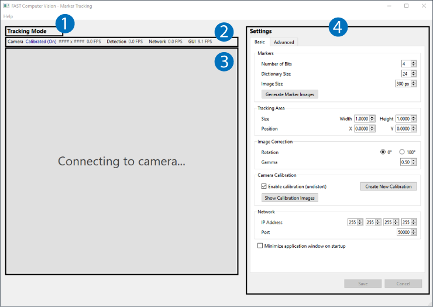

# User Manual for FAST Computer Vision

Use FAST Computer Vision to:
 - Detect and track ArUco markers for input to another application
 - Generate images of ArUco markers for printing
 - Calibrate a camera to remove lens distortion

---

## User Interface

There are four key areas of the application window to be familiar with:

1. The **Mode** area tells you the mode of operation the application is 
currently in. There are two modes of operation

    - *Tracking Mode* will track ArUco markers and display their ID,
    position, orientation, and size in the **View** area. In this mode 
    you can adjust settings that affect the marker detection, camera 
    image, and network communication.
    
    - *Calibration Mode* will stop marker tracking and guide you 
    through the steps to calibrate the camera and remove lens distortion. 
    In this mode, you will manually capture images of a calibration 
    checkerboard to calculate the lens distortion. As you capture each 
    image, the detection of the checkerboard will be visualized in the 
    **View** area.

2. The **Stats** area gives you info about camera attributes and 
perfromance frame rates. Each stat provides info as follows:

    - *Camera* stats include whether the camera is calibrated (on/off) 
    or not, the pixel dimensions of the camera image, and the frame 
    rate that the camera image is being read (which could be lower than 
    than the frame rate the camera is operating at).
    
    - *Detection* stats include the frame rate that the markers are 
    detected in *Tracking Mode* and the frame rate the checkerboard is 
    detected in *Calibration Mode*.

    - *Network* stats include the frame rate that the tracking data 
    is sent to the network.

    - *GUI* stats include the frame rate that the **View** and 
    **Stats** areas are updated. This framerate is purposely kept low 
    to minimize the impact on tracking performance and user interface 
    responsiveness.

3. The **View** area shows a live view of the camera with different 
visualizations depending on the mode of operation.

    - In *Tracking Mode*, the marker ID, position, orientation, and 
    size are visualized. Also, the tracking area bounding box and 
    center point of the camera image are displayed.

    - In *Calibration Mode*, detection of the calibration checkerboard 
    is visualized.

    - When the camera is disconnected, the message "Connecting to 
    camera..." is displayed while the application retrys the connection 
    until a camera is connected.

4. The **Controls** area provides settings and buttons to control the 
current mode of operation.

    - In *Tracking Mode*, there are Basic settings to control the 
    tracking area, image correction, camera calibration on/off, and 
    network communication. There are also Advanced settings to control 
    the marker detection.

    - In *Calibration Mode*, there are controls to configure the 
    checkerboard, capture images, calculate the calibration, and preview 
    the calibration before applying it.

---

## Basic Settings

### Markers

See the full OpenCV ArUco module documentation for a detailed 
explanation of markers, dictionaries, and how detection works at 
[Detection of ArUco Markers Tutorial](https://docs.opencv.org/4.x/d5/dae/tutorial_aruco_detection.html).

> ***Number of Bits***
>
> The number of binary bits in one dimension that make up each marker. 
Values are in the range [4, 7].

> ***Dictionary Size***
>
> The number of unique IDs in the marker set that can possibly be 
detected. Keep this number fairly close to the number of unique IDs 
that you actually need to minimize false detection of marker IDs that 
aren't being used. Values are in the range [1, 256].

> ***Image Size***
>
> The size of a square on the calibration checkerboard, measured in 
millimeters (mm). Values are in the range [30, 900].

> ***Generate Marker Images (Button)***
>
> Creates PNG images of the markers based on the *Number of Bits*, 
*Dictionary Size*, and *Image Size*. The images are exported to the 
**Markers** subfolder.

### Tracking Area

Any markers outside the tracking area will be ignored and won't be 
tracked. Restricting the tracking area can sometimes be helpful to 
improve performance.

>  ***Size***
>
> The Width and Height of the tracking area bounding box. Values are 
normalized in the range [0, 1].

> ***Position***
>
> The X, Y coordinate position of the tracking area bounding. The anchor 
point of the tracking area is the top-left and the origin of the camera 
image is also the top-left. Values are normalized in the range [0, 1].

### Image Correction

> ***Rotation***
> 
> Rotate the camera image 180 degrees if the camera is mounted 
upside-down.

> ***Gamma***
> 
> Apply gamma correction to change the lumaniance of the camera image. 
Values are in the range [0.25, 1].

### Camera Calibration

> ***Enable Calibration***
> 
> Check this box to apply camera calibration to undistort the camera 
image. The checkbox will be disabled if the camera has not been 
calibrated and no calibration file is available.

> ***Create New Calibration (Button)***
> 
> Switches the *Calibration Mode* to begin the camera calibration process.

> ***Show Calibration Images***
> 
> Opens the folder where the calibration images have been saved in File 
Explorer. This could be useful to review the images if camera 
calibration did not work as expected.

### Network

UDP is used for network communication.

> ***IP Address***
> 
> The IP address where the marker tracking data should be sent. Either a 
singular or broadcast IP address can be used.

> ***Port***
> 
> The UDP port where the marker tracking data should be sent.

### Minimize on Startup

Check this box if you want the application window to minimize when it 
starts up. This can be helpful if you need to hide the application so 
it doesn't obstruct another application that is the primary user 
experience.

### Save/Cancel

When you change a setting, the *Save* and *Cancel* buttons will be enabled. 
Press *Save* if you want to save your current settings or press *Cancel* if 
you want to revert to your previous settings before you made changes 
(this will just reload the settings from the last save point).

---

## Advanced Settings

The following descriptions of Advanced settings are a redistribution of 
parameter descriptions in the OpenCV ArUco module documentation licensed 
under the Apache License, Version 2.0. A copy of the Apache License, 
Version 2.0 is provided in the LICENSES folder. For more information 
about this license, see <http://www.apache.org/licenses/LICENSE-2.0>. 
The full OpenCV ArUco module documentation is available at 
[Detection of ArUco Markers Tutorial](https://docs.opencv.org/4.x/d5/dae/tutorial_aruco_detection.html) 
and [DetectorParameters Struct Reference](https://docs.opencv.org/4.x/d1/dcd/structcv_1_1aruco_1_1DetectorParameters.html).

### Thresholding

> ***adaptiveThreshWinSizeMin***
>
> Minimum window size for adaptive thresholding before finding contours. 
Values are in the range [3, 50].

> ***adaptiveThreshWinSizeMax***
>
> Maximum window size for adaptive thresholding before finding contours. 
Values are in the range [3, 50].

> ***adaptiveThreshWinSizeStep***
>
> Increments from adaptiveThreshWinSizeMin to adaptiveThreshWinSizeMax during the thresholding. 
Values are in the range [1, 15].

> ***adaptiveThreshConstant***
>
> Constant for adaptive thresholding before finding contours. 
Values are in the range [0, 20].

### Contour Filtering

> ***minMarkerPerimeterRate***
>
> Determine minimum perimeter for marker contour to be detected. 
This is defined as a rate respect to the maximum dimension of the input image. 
Values are in the range [0.001, 0.1].

> ***maxMarkerPerimeterRate***
>
> Determine maximum perimeter for marker contour to be detected. 
This is defined as a rate respect to the maximum dimension of the input image. 
Values are in the range [1, 10].

> ***polygonalApproxAccuracyRate***
>
> Minimum accuracy during the polygonal approximation process to determine which contours are squares. 
Values are in the range [0.01, 0.25].

> ***minCornerDistanceRate***
>
>  Minimum distance between corners for detected markers relative to its perimeter. 
Values are in the range [0.01, 0.25].

> ***minMarkerDistanceRate***
>
> Minimum mean distance beetween two marker corners to be considered similar, so that the smaller one is removed. 
The rate is relative to the smaller perimeter of the two marker. 
Values are in the range [0.01, 0.25].

> ***minDistanceToBorder***
>
> Minimum distance of any corner to the image border for detected markers (in pixels). 
Values are in the range [1, 10].

### Bits Extraction

> ***markerBorderBits***
>
> Number of bits of the marker border, i.e. marker border width. 
Values are in the range [1, 5].

> ***minOtsuStdDev***
>
> Minimun standard deviation in pixels values during the decodification step to apply Otsu thresholding 
(otherwise, all the bits are set to 0 or 1 depending on mean higher than 128 or not). 
Values are in the range [1, 10].

> ***perspectiveRemovePixelPerCell***
>
> Number of bits (per dimension) for each cell of the marker when removing the perspective. 
Values are in the range [1, 10].

> ***perspectiveRemoveIgnoredMarginPerCell***
>
> Width of the margin of pixels on each cell not considered for the determination of the cell bit. 
Represents the rate respect to the total size of the cell, i.e. perspectiveRemovePixelPerCell. 
Values are in the range [0.01, 0.5].

### Marker Identification

> ***maxErroneousBitsInBorderRate***
>
> Maximum number of accepted erroneous bits in the border (i.e. number of allowed white bits in the border). 
Represented as a rate respect to the total number of bits per marker. 
Values are in the range [0.01, 0.5].

> ***errorCorrectionRate***
>
> Error correction rate respect to the maximun error correction capability for each dictionary. 
Values are in the range [0.01, 1].

---

## Camera Calibration Settings

### Checkerboard

> ***Squares***
>
> The properties of the squares on the checkerboard. Horizontal is the 
number of horizontal squares and Vertical is the number of veritcal 
squares. Values are in the range [1, 100]. Size is the physical size of 
a square, measured in millimeters (mm). Values are in the range [1, 500].

---

## Camera Calibration Steps

To switch to *Calibration Mode*, click on the *Create New Calibration* 
button under **Basic Settings** while in *Tracking Mode*.

1. Preparation

    - Check the camera image to ensure it is evenly and well lit by the 
    infrared lights.

    -  Make sure that your checkboard is in good condition and ready 
    for use. It should be flat, without damage or distortion.
    
    - Verify that your checkerboard matches the settings for 
    *Horizontal*, *Vertical*, and *Size* properties.

2. Capturing Images

    - This is an iterative step, where you will position the 
    calibration board, press the *Capture Image* button to start 
    acquisition, then adjust the calibration board until it is 
    acquired, and repeat the process at least 12 times.

    - You will need to move the board evenly over the entire camera 
    view as you capture images.

    - You should also orient the board both flat and tilted in 
    horizontal/vertical angles up to +/- 45 degrees.

    - When you press the *Capture Image* button to start acquisition, 
    look for raindow colored dots and lines connection them at 
    instersections of the checkerboard. This indicates that the board 
    has been acquired and the image is about to be captured.

    - Once the checkerboard is acquired, the screen with flash black 
    as the image is caputred and the visualization will disappear. 
    The progress bar for number of images captured will increase by one 
    (1).

    - Change the position the calibration board and press the 
    *Capture Image* button to start acquisition again. Adjust the 
    position of the board until it is acquired and the image is 
    captured.

    - Repeat this process until you have at least 12 images captured. 
    
    - Don't bother capturing too many images because each image provides 
    diminishing returns on the accuracy of calibration and just 
    increases the processing time. 12 images should work fine, but try 
    to stay under 24 if you want to take more.

    - For more information about calibration, see 
    [Calibration Best Practices from Calib.io](https://calib.io/blogs/knowledge-base/calibration-best-practices).

3. Calibration

    - When you have at least 12 images captured, the 
    *Calculate Calibration* button will become enabled.

    - Press the *Calculate Calibration* button to prcoess the images 
    you captured and calculate the calibration. This will take few 
    seconds.

4. Review

    - When the calibration is done calculating, the **View** area will 
    update to show the live camera images with the calibration applied. 

    - Toggle the calibration on/off as you review the results using the 
    *Enable calibration preview* checkbox.

    - RMS reprojection error is provided, but it may not be an accurate 
    measure of good/bad calibration result. A bad calibration should be 
    visually obvious, though. As a rough guide, you should expect the 
    reprojection error to be in the range [0, 1].

    - If you are happy with the calibration result, press the *Save* 
    button to keep it. Captured calibration images are saved to the 
    **Calibration** subfolder. A saved calibration will automatically 
    load when the application starts up.

    - If you are unhappy with the calibration result, press the 
    *Cancel* button to discard it and return to *Tracking Mode*. Then 
    click on the *Create New Calibration* button under 
    **Basic Settings** to try again.

---

Copyright (C) 2024 Museum of Science, Boston
<https://www.mos.org/>

This document was developed through a grant to the Museum of Science, 
Boston from the Institute of Museum and Library Services under Award 
#MG-249646-OMS-21. For more information about this grant, see 
<https://www.imls.gov/grants/awarded/mg-249646-oms-21>.